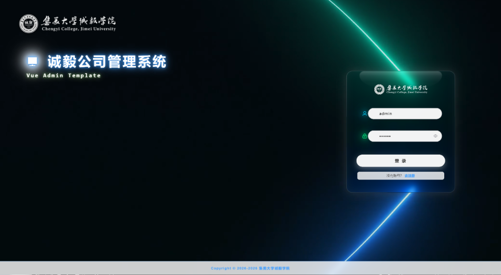
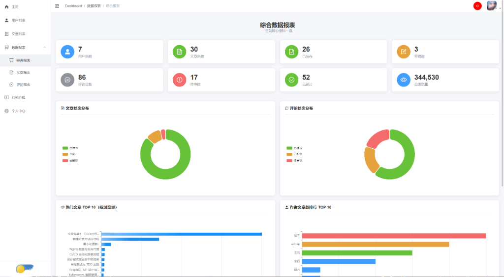
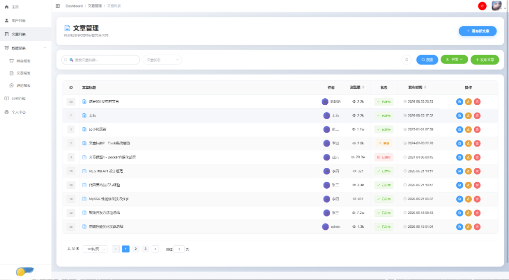

# Vue-Admin Content Management System

> A modern full-stack content management system built with Vue.js 2 + Element UI and Flask + MySQL

**Authors**: [Ever-5475](https://github.com/Ever-5475) & [XJW-051226](https://github.com/XJW-051226) & [CodeGlow-coder](https://github.com/CodeGlow-coder)


[中文文档](README-zh.md)

## Screenshots

### Login Page

*Glass-morphism login page with dynamic background*

### Dashboard

*Real-time statistics, quick actions, and company introduction*

### Data Reports

*Comprehensive data visualization with ECharts*

### Article Management

*Full CRUD operations with search, sort, and export*

## Features

| Module | Features |
|--------|----------|
| **Authentication** | JWT token, login/register, role-based access |
| **User Management** | CRUD, role assignment, profile editing |
| **Article Management** | Rich text editor, search, sort by views, Excel export |
| **Comment Management** | CRUD, moderation (approve/reject/pending) |
| **Data Reports** | Dashboard, trends, TOP rankings, word cloud |
| **UI/UX** | Light/Dark theme, responsive design, glass effects |

## Tech Stack

### Frontend
| Technology | Version | Purpose |
|------------|---------|---------|
| Vue.js | 2.6.10 | Core framework |
| Vue Router | 3.0.6 | Routing |
| Vuex | 3.1.0 | State management |
| Element UI | 2.13.2 | UI components |
| Axios | 0.18.1 | HTTP client |
| ECharts | 5.6.0 | Data visualization |

### Backend
| Technology | Purpose |
|------------|---------|
| Flask | Web framework |
| PyMySQL | MySQL driver |
| PyJWT | JWT authentication |
| MySQL | Database |

## Quick Start

### Prerequisites
- Node.js >= 12
- Python >= 3.7
- MySQL >= 5.7

### Backend Setup

```bash
# Install dependencies
pip install flask pymysql pyjwt

# Configure database in config.py
# MYSQL_HOST = 'localhost'
# MYSQL_USER = 'root'
# MYSQL_PASSWORD = 'your_password'
# MYSQL_DB = 'vue_admin'

# Start server
python app.py
```

Backend runs at `http://localhost:5000`

### Frontend Setup

```bash
# Install dependencies
npm install

# Start dev server
npm run dev
```

Visit http://localhost:9528

## Default Accounts

| Username | Password | Role |
|----------|----------|------|
| admin | 111111 | Admin |
| test | 111111 | User |

## Project Structure

```
├── app.py              # Flask backend (all API routes)
├── models.py           # Database models (User/Article/Comment)
├── config.py           # Configuration (DB, JWT)
├── src/
│   ├── api/            # API request modules
│   ├── components/     # Reusable components
│   ├── router/         # Vue Router config
│   ├── store/          # Vuex store
│   ├── styles/         # Global styles (theme support)
│   ├── utils/          # Utilities (request, auth)
│   └── views/          # Page components
└── public/             # Static assets
```

## API Endpoints

| Module | Endpoints | Description |
|--------|-----------|-------------|
| Auth | 4 | Login, logout, register, user info |
| Users | 7 | User CRUD, profile update |
| Articles | 5 | Article CRUD, details |
| Comments | 7 | Comment CRUD, moderation, stats |
| Reports | 5 | Dashboard, article, comment, activity, popular |
| Database | 2 | Statistics, table list |

**Total: 30 API endpoints**

## License

[MIT](LICENSE)

---

*Built with ❤️ using Vue.js + Flask*+ MySQL
